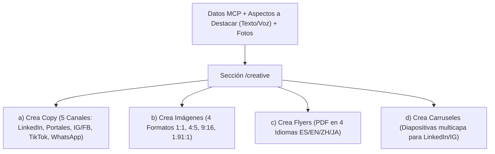

# Plan Detallado de Implementación — Módulo A: Creative Area

El **Módulo A (Creative Area)** es el motor de marketing de **ikasi-cmo**. Su objetivo es transformar los datos técnicos de una propiedad (obtenidos del MCP de IKASI) y los insumos del usuario en entregables de marketing multicanal de alto impacto (LinkedIn, Instagram, Facebook, TikTok, WhatsApp, Portales Inmobiliarios y Web).

---

## 1. Arquitectura y UX de la Sección Creative Area (`/creative`)

Al hacer clic en **Creative Area** desde la Landing Page, la aplicación abrirá una página dedicada (`src/app/creative/page.tsx`).

### 1.1. Panel de Entrada de Datos (Input Bar & Assets)
El usuario contará con una interfaz de entrada estructurada:
1. **Selector de Código de Propiedad (`property_code`):** Input con autocompletado y consulta instantánea al MCP de IKASI (ej. `BIR-590`, `BIV-1095`, `OC-1015`).
2. **Barra de "Aspectos a Destacar" (Input Texto + Dictado por Voz 🎙️):** 
   - Campo de texto libre para agregar notas o ángulos comerciales específicos.
   - **Botón de Grabación de Audio (Web Speech API / Dictado por Voz):** Permite al usuario presionar un botón de micrófono, dictar en voz alta los aspectos a destacar (ej. *"Nave recién remodelada con 500 KVA y rampas niveladoras"*), y el sistema transcribe automáticamente el audio a texto dentro del campo de entrada.
3. **Uploader de Imágenes de Apoyo con Normalizador Automático:**
   - Permite arrastrar imágenes de la propiedad con un límite configurado (ej. máximo 6 imágenes).
   - **Normalizador Integrado:** Ajusta automáticamente el peso en memoria (optimización WebP/JPEG) y garantiza una resolución mínima sin saturar el servidor.

---

## 2. Los 4 Modos de Generación (Botones de Acción)

Una vez ingresados los datos, el usuario podrá seleccionar libremente entre 4 botones de acción con vista previa en tiempo real y edición en vivo:

---

### 🟢 Opción A: "Crea Copy" (Motor de IA Multicanal - 5 Canales Separados)
Generación inteligente adaptada al tono y audiencia de cada canal mediante LLM (OpenAI/Claude/DeepSeek):

1. **LinkedIn (Corporativo & C-Level):** Tono estrictamente corporativo, enfocado en ejecutivos C-Level, directores de logística y expansión, ROI, ventajas estratégicas de ubicación e infraestructura industrial de nivel internacional.
2. **Portales Inmobiliarios (Dueños de Negocio & Gerentes de Expansión):** Tono profesional-comercial, altamente descriptivo de la operación diaria (usos de suelo, accesibilidad, facilidades operativas, condiciones de arrendamiento/compra) directo a dueños de negocio y gerentes operativos.
3. **TikTok (Hooks & Tendencia):** Tono muy dinámico con *Hooks* llamativos en los primeros 3 segundos, estructura de guion y llamados a la acción visuales.
4. **Instagram & Facebook (Reels & Feed):** Tono enfocado en storytelling visual, párrafos limpios, emojis bien estructurados y llamado a la acción.
5. **WhatsApp & Historias:** Copy ultraconciso, directo a las especificaciones clave con llamada directa a contacto.
6. **Editor en Vivo:** Panel con pestañas independientes por los 5 canales donde el usuario puede editar el texto antes de copiarlo al portapapeles con un clic.

---

### 🟢 Opción B: "Crea Imágenes" (Motor Gráfico Interno 4 Formatos)
Generación autónoma (HTML Canvas/SVG) con la paleta de colores corporativa (`#050205`, `#140919`, `#CF9C8C`):

- **9:16 (Vertical):** Para Stories de Instagram/Facebook, Reels, TikTok y Estados de WhatsApp.
- **4:5 (Vertical Feed):** Máxima visibilidad en el feed de Instagram y Facebook.
- **1:1 (Cuadrado):** Formato universal.
- **1.91:1 (Horizontal):** Para banners, Facebook link previews, LinkedIn y Portales.
- **Funcionalidad:** Vista previa interactiva de las 4 piezas gráficas con opción de descarga individual (PNG) o paquete ZIP.

---

### 🟢 Opción C: "Crea Flyers" (Afiches PDF en 4 Idiomas)
Generador de fichas/afiches membretados en PDF listos para descargar o imprimir:
- **Selector de Idioma:** Español 🇪🇸, Inglés 🇺🇸, Chino-Mandarín 🇨🇳, Japonés 🇯🇵.
- **Diseño Membretado:** Plantilla gráfica elegante con el logo de **Ikasi Inmobiliaria®**, foto destacada, tabla de especificaciones técnicas y datos de contacto.

---

### 🟢 Opción D: "Crea Carruseles" (Diapositivas Multicapa)
Diseñador de carruseles paso a paso para publicaciones deslizables en LinkedIn e Instagram:
- Generación de un conjunto de 3 a 5 diapositivas cuadradas o verticales (1080x1080 / 1080x1350).
- **Estructura:**
  - Slide 1: Portada impactante con el título comercial y foto principal.
  - Slides 2 y 3: Especificaciones clave (Superficie, Altura, Andenes, KVA) resaltadas visualmente.
  - Slide Final: Cierre corporativo con Call to Action (CTA) y datos de contacto de Ikasi Inmobiliaria®.

---

## 3. Estructura de Archivos a Crear

- `src/app/creative/page.tsx` — Vista principal de la sección Creative Area.
- `src/components/creative/PropertyInputHeader.tsx` — Barra de consulta MCP, input de aspectos a destacar y uploader optimizado.
- `src/components/creative/CopyGenerator.tsx` — Componente de generación de copys con pestañas multicanal.
- `src/components/creative/ImageGenerator.tsx` — Componente de generación gráfica en 4 formatos.
- `src/components/creative/FlyerGenerator.tsx` — Generador de flyers PDF en 4 idiomas.
- `src/components/creative/CarouselGenerator.tsx` — Diseñador de carruseles multicapa.
- `src/app/api/creative/copy/route.ts` — API Route para conectar con LLM.
- `src/lib/utils/imageOptimizer.ts` — Normalizador y optimizador de imágenes.

---

## 4. Plan de Verificación y Pruebas

1. **Prueba de Ingesta:** Probar con códigos reales (`BIR-590`, `BIV-1095`, `OC-1015`) agregando notas en "Aspectos a destacar" por texto o voz.
2. **Prueba de Copy:** Validar que LinkedIn genere un texto corporativo y Portales uno descriptivo operativo.
3. **Prueba de Gráficos:** Comprobar que los 4 formatos de imagen se visualicen correctamente y exporten a PNG.
4. **Prueba de Flyers:** Descargar el PDF en Español e Inglés y verificar membrete y maquetación.
